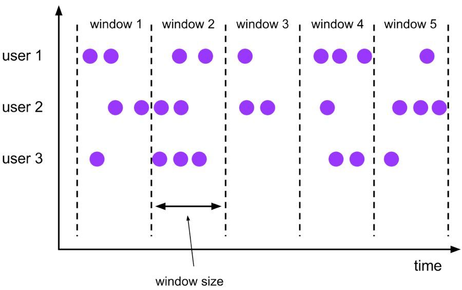

# test-flink-sql
test-flink-sql

```sql
insert:
  INSERT INTO tableReference
  query

query:
  values
  | {
      select
      | selectWithoutFrom
      | query UNION [ ALL ] query
      | query EXCEPT query
      | query INTERSECT query
    }
    [ ORDER BY orderItem [, orderItem ]* ]
    [ LIMIT { count | ALL } ]
    [ OFFSET start { ROW | ROWS } ]
    [ FETCH { FIRST | NEXT } [ count ] { ROW | ROWS } ONLY]

orderItem:
  expression [ ASC | DESC ]

select:
  SELECT [ ALL | DISTINCT ]
  { * | projectItem [, projectItem ]* }
  FROM tableExpression
  [ WHERE booleanExpression ]
  [ GROUP BY { groupItem [, groupItem ]* } ]
  [ HAVING booleanExpression ]
  [ WINDOW windowName AS windowSpec [, windowName AS windowSpec ]* ]

selectWithoutFrom:
  SELECT [ ALL | DISTINCT ]
  { * | projectItem [, projectItem ]* }

projectItem:
  expression [ [ AS ] columnAlias ]
  | tableAlias . *

tableExpression:
  tableReference [, tableReference ]*
  | tableExpression [ NATURAL ] [ LEFT | RIGHT | FULL ] JOIN tableExpression [ joinCondition ]

joinCondition:
  ON booleanExpression
  | USING '(' column [, column ]* ')'

tableReference:
  tablePrimary
  [ [ AS ] alias [ '(' columnAlias [, columnAlias ]* ')' ] ]

tablePrimary:
  [ TABLE ] [ [ catalogName . ] schemaName . ] tableName
  | LATERAL TABLE '(' functionName '(' expression [, expression ]* ')' ')'
  | UNNEST '(' expression ')'

values:
  VALUES expression [, expression ]*

groupItem:
  expression
  | '(' ')'
  | '(' expression [, expression ]* ')'
  | CUBE '(' expression [, expression ]* ')'
  | ROLLUP '(' expression [, expression ]* ')'
  | GROUPING SETS '(' groupItem [, groupItem ]* ')'

windowRef:
    windowName
  | windowSpec

windowSpec:
    [ windowName ]
    '('
    [ ORDER BY orderItem [, orderItem ]* ]
    [ PARTITION BY expression [, expression ]* ]
    [
        RANGE numericOrIntervalExpression {PRECEDING}
      | ROWS numericExpression {PRECEDING}
    ]
    ')'
```

### select

> SELECT 用于从 DataSet/DataStream 中选择数据，用于筛选出某些列。

```sql
SELECT * FROM Table；// 取出表中的所有列
SELECT name，age FROM Table；// 取出表中 name 和 age 两列
```

> 与此同时 SELECT 语句中可以使用函数和别名，例如我们上面提到的 WordCount 中：

```sql
SELECT word, COUNT(word) FROM table GROUP BY word;
```

> WHERE 用于从数据集/流中过滤数据，与 SELECT 一起使用，用于根据某些条件对关系做水平分割，即选择符合条件的记录。

```sql
SELECT name，age FROM Table where name LIKE ‘% 小明 %’；
SELECT * FROM Table WHERE age = 20；
```

> WHERE 是从原数据中进行过滤，那么在 WHERE 条件中，Flink SQL 同样支持 =、<、>、<>、>=、<=，以及 AND、OR 等表达式的组合，最终满足过滤条件的数据会被选择出来。并且 WHERE 可以结合 IN、NOT IN 联合使用。举个负责的例子：

```sql
SELECT name, age
FROM Table
WHERE name IN (SELECT name FROM Table2)
```

> DISTINCT 用于从数据集/流中去重根据 SELECT 的结果进行去重。

```sql
SELECT DISTINCT name FROM Table;
```

> GROUP BY 是对数据进行分组操作。例如我们需要计算成绩明细表中，每个学生的总分。

```sql
SELECT name, SUM(score) as TotalScore FROM Table GROUP BY name;
```

> UNION 用于将两个结果集合并起来，要求两个结果集字段完全一致，包括字段类型、字段顺序。不同于 UNION ALL 的是，UNION 会对结果数据去重。

```sql
SELECT * FROM T1 UNION (ALL) SELECT * FROM T2；
```

>JOIN 用于把来自两个表的数据联合起来形成结果表，Flink 支持的 JOIN 类型包括：
>
>- JOIN - INNER JOIN
>- LEFT JOIN - LEFT OUTER JOIN
>- RIGHT JOIN - RIGHT OUTER JOIN
>- FULL JOIN - FULL OUTER JOIN
>
>LEFT JOIN 与 JOIN 的区别是当右表没有与左边相 JOIN 的数据时候，右边对应的字段补 NULL 输出，RIGHT JOIN 相当于 LEFT JOIN 左右两个表交互一下位置。FULL JOIN 相当于 RIGHT JOIN 和 LEFT JOIN 之后进行 UNION ALL 操作。

```sql
SELECT *
FROM Orders
INNER JOIN Product ON Orders.productId = [Product.id](http://product.id/)

SELECT *
FROM Orders
LEFT JOIN Product ON Orders.productId = [Product.id](http://product.id/)

SELECT *
FROM Orders
RIGHT JOIN Product ON Orders.productId = [Product.id](http://product.id/)

SELECT *
FROM Orders
FULL OUTER JOIN Product ON Orders.productId = [Product.id](http://product.id/)
```

### Group Window

>根据窗口数据划分的不同，目前 Apache Flink 有如下 3 种 Bounded Window：
>
>- Tumble，滚动窗口，窗口数据有固定的大小，窗口数据无叠加；
>- Hop，滑动窗口，窗口数据有固定大小，并且有固定的窗口重建频率，窗口数据有叠加；
>- Session，会话窗口，窗口数据没有固定的大小，根据窗口数据活跃程度划分窗口，窗口数据无叠加。

### Tumble Window

> Tumble 滚动窗口有固定大小，窗口数据不重叠，具体语义如下：



Tumble 滚动窗口对应的语法如下：

```sql
SELECT 
    [gk],
    [TUMBLE_START(timeCol, size)], 
    [TUMBLE_END(timeCol, size)], 
    agg1(col1), 
    ... 
    aggn(colN)
FROM Tab1
GROUP BY [gk], TUMBLE(timeCol, size)
```

举个例子，假如我们要计算每个人每天的订单量，按照 user 进行聚合分组：

```sql
SELECT USER,
       TUMBLE_START(rowtime, INTERVAL ‘1’ DAY) AS wStart,
       SUM(amount)
FROM Orders
GROUP BY TUMBLE(rowtime, INTERVAL ‘1’ DAY),
         USER;
```

### Hop Window

> Hop 滑动窗口和滚动窗口类似，窗口有固定的 size，与滚动窗口不同的是滑动窗口可以通过 slide 参数控制滑动窗口的新建频率。因此当 slide 值小于窗口 size 的值的时候多个滑动窗口会重叠，具体语义如下：
>
> Hop-windows 有两个关键参数，`window size` 表明窗口大小，`window slide` 表明窗口滑动窗口的新建频率。


```sql
SELECT 
    [gk], 
    [HOP_START(timeCol, slide, size)] ,  
    [HOP_END(timeCol, slide, size)],
    agg1(col1), 
    ... 
    aggN(colN) 
FROM Tab1
GROUP BY [gk], HOP(timeCol, slide, size)
```

举例说明，我们要每过一小时计算一次过去 24 小时内每个商品的销量：

```sql
SELECT product,
       SUM(amount)
FROM Orders
GROUP BY HOP(rowtime, INTERVAL '1' HOUR, INTERVAL '1' DAY),
         product
```

### Session Window

> 会话时间窗口没有固定的持续时间，但它们的界限由 `interval` 不活动时间定义，即如果在定义的间隙期间没有出现事件，则会话窗口关闭。


```sql
SELECT 
    [gk], 
    SESSION_START(timeCol, gap) AS winStart,  
    SESSION_END(timeCol, gap) AS winEnd,
    agg1(col1),
     ... 
    aggn(colN)
FROM Tab1
GROUP BY [gk], SESSION(timeCol, gap)
```

例如，我们需要计算每个用户访问时间 12 小时内的订单量：

```sql
SELECT USER,
       SESSION_START(rowtime, INTERVAL ‘12’ HOUR) AS sStart,
       SESSION_ROWTIME(rowtime, INTERVAL ‘12’ HOUR) AS sEnd,
       SUM(amount)
FROM Orders
GROUP BY SESSION(rowtime, INTERVAL ‘12’ HOUR),
         USER
```

### **Flink SQL 的内置函数**

- 比较函数
- 逻辑函数
- 算术函数
- 字符串处理函数
- 时间函数

#### 5.1 比较函数

| 比较函数                    | 描述                                                         |
| :-------------------------- | :----------------------------------------------------------- |
| value1=value2               | 如果 value1 等于 value2，则返回 TRUE ; 如果 value1 或 value2 为 NULL，则返回 UNKNOWN |
| value1<>value2              | 如果 value1 不等于 value2，则返回 TRUE ; 如果 value1 或 value2 为 NULL，则返回 UNKNOWN |
| value1>value2               | 如果 value1 大于 value2，则返回 TRUE ; 如果 value1 或 value2 为 NULL，则返回 UNKNOWN |
| value1 < value2             | 如果 value1 小于 value2，则返回 TRUE ; 如果 value1 或 value2 为 NULL，则返回 UNKNOWN |
| value IS NULL               | 如果 value 为 NULL，则返回 TRUE                              |
| value IS NOT NULL           | 如果 value 不为 NULL，则返回 TRUE                            |
| string1 LIKE string2        | 如果 string1 匹配模式 string2，则返回 TRUE ; 如果 string1 或 string2 为 NULL，则返回 UNKNOWN |
| value1 IN (value2, value3…) | 如果给定列表中存在 value1 （value2，value3，…），则返回 TRUE 。当（value2，value3，…）包含 NULL，如果可以找到该数据元则返回 TRUE，否则返回 UNKNOWN。如果 value1 为 NULL，则始终返回 UNKNOWN |

#### 5.2 逻辑函数

| 逻辑函数           | 描述                                                         |
| :----------------- | :----------------------------------------------------------- |
| A OR B             | 如果 A 为 TRUE 或 B 为 TRUE，则返回 TRUE                     |
| A AND B            | 如果 A 和 B 都为 TRUE，则返回 TRUE                           |
| NOT boolean        | 如果 boolean 为 FALSE，则返回 TRUE，否则返回 TRUE。如果 boolean 为 TRUE，则返回 FALSE |
| A IS TRUE 或 FALSE | 判断 A 是否为真                                              |

#### 5.3 算术函数

| 算术函数                  | 描述                               |
| :------------------------ | :--------------------------------- |
| numeric1 ±*/ numeric2     | 分别代表两个数值加减乘除           |
| ABS(numeric)              | 返回 numeric 的绝对值              |
| POWER(numeric1, numeric2) | 返回 numeric1 上升到 numeric2 的幂 |

#### 5.4 字符串处理函数

| 字符串函数                 | 描述                                                 |
| :------------------------- | :--------------------------------------------------- |
| UPPER/LOWER                | 以大写 / 小写形式返回字符串                          |
| LTRIM(string)              | 返回一个字符串，从去除左空格的字符串, 类似还有 RTRIM |
| CONCAT(string1, string2,…) | 返回连接 string1，string2，…的字符串                 |

#### 5.5 时间函数

| 时间函数                       | 描述                                                         |
| :----------------------------- | :----------------------------------------------------------- |
| DATE string                    | 返回以“yyyy-MM-dd”形式从字符串解析的 SQL 日期                |
| TIMESTAMP string               | 返回以字符串形式解析的 SQL 时间戳，格式为“yyyy-MM-dd HH：mm：ss [.SSS]” |
| CURRENT_DATE                   | 返回 UTC 时区中的当前 SQL 日期                               |
| DATE_FORMAT(timestamp, string) | 返回使用指定格式字符串格式化时间戳的字符串                   |


